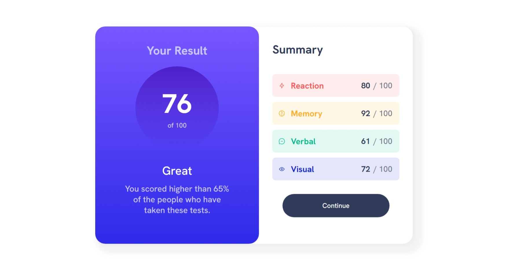
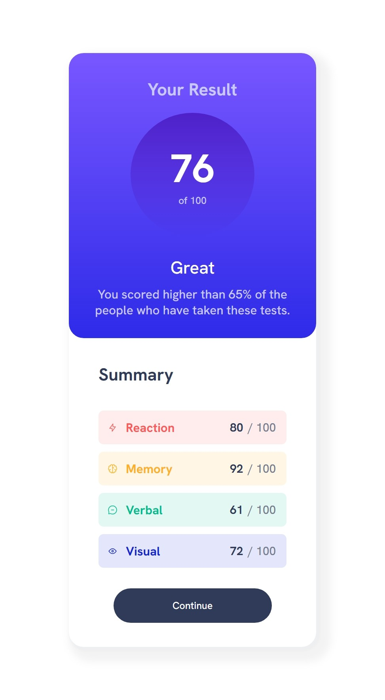

## Overview

### The challenge

Users should be able to:

- View the optimal layout for the interface depending on their device's screen size
- See hover and focus states for all interactive elements on the page

### Screenshot

- SCREENSHOOT HORIZONTAL 

- SCREENSHOOT VERTICAL

-- what i have to write:

 

    Challenge by <a href="https://www.frontendmentor.io?ref=challenge" target="_blank">Frontend Mentor</a>. 
    Coded by <a href="#">Your Name Here</a>.
  

- what i learned:

    - set full size page:
        .page{
            min-height:100vh;
        }
    - set background color with gradiant:
        .background-color-fill{
            background-image: linear-gradient(hsl(252, 100%, 67%), hsl(241, 81%, 54%));
        }
    - set responsive layout when user reduce size windown:
        @media screen and (max-width: 800px){ 
            .cssUpdate{
                ------
            }
        }

